# 🚀 HyperLocal Service Platform

[](https://nodejs.org/) [](https://expressjs.com/) [](https://angular.io/) [](https://www.typescriptlang.org/) [](https://sequelize.org/) [](https://jwt.io/)

---

## 🌐 Live Demo

- **Frontend:** [https://hyperlocal-services.vercel.app/](https://hyperlocal-services.vercel.app/)
- **Backend API:** [https://hyperlocal-services.onrender.com/](https://hyperlocal-services.onrender.com/)

---

## 🌟 Project Overview

**HyperLocal Service Platform** is a production-grade, full-stack web application connecting customers with local service providers. It features real-time booking, provider management, and robust admin controls. Built with modern technologies and best practices, it is designed for scalability, security, and an exceptional user experience.

---

## ✨ Project Highlights
- **Role-Based Access:** Distinct flows for Customers, Providers, and Admins
- **End-to-End Booking:** Real-time service booking and management
- **Secure & Scalable:** JWT authentication, modular codebase, and scalable architecture
- **Modern UI/UX:** Responsive Angular frontend with professional design
- **Production-Grade:** Clean code, maintainable structure, and extensible features

---


## 🧩 Features

### 👤 Customer Features
- Browse and search for local services
- Book services with real-time availability
- Manage bookings and view history
- Rate and review providers
- In-app notifications and chat with providers

### 🧑‍💼 Provider Features
- Profile and KYC management
- Manage offered services and availability
- Accept or reject bookings
- View customer reviews and ratings
- Real-time notifications and chat with customers

### 🛡️ Admin Features
- Comprehensive dashboard and analytics
- Manage users, providers, and services
- Review and approve provider KYC
- Generate reports and monitor platform activity
- Handle disputes and oversee reviews

---


## 🛠️ Tech Stack

| Layer      | Technology                        |
|------------|-----------------------------------|
| Frontend   | Angular, TypeScript, RxJS         |
| Backend    | Node.js, Express.js, Socket.io    |
| Database   | SQL (Sequelize ORM)               |
| Auth       | JWT (JSON Web Tokens)             |
| API        | RESTful, WebSockets               |

---

## 🏗️ Architecture & System Design

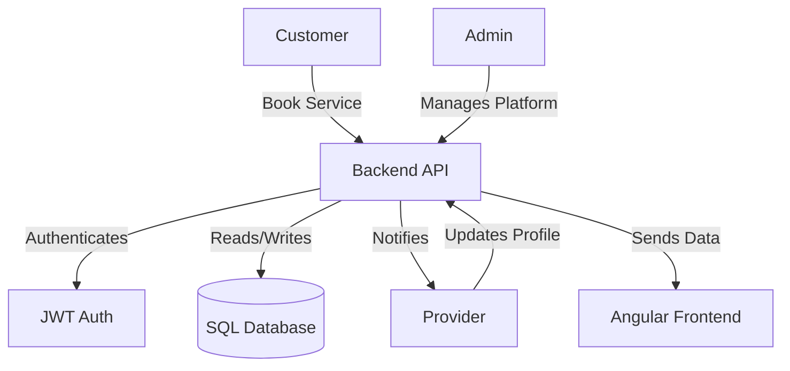

- **Decoupled Frontend & Backend:** Enables independent deployment and scaling.
- **Stateless JWT Authentication:** Secure, scalable, and easy to integrate with any frontend.
- **WebSocket Support:** Real-time chat and location tracking via Socket.io.

---

---

## 🏗️ Architecture Flow


- **Responsive & Scalable:** Modular backend, decoupled frontend, and stateless JWT authentication ensure high scalability and maintainability.
- **Separation of Concerns:** Clear separation between business logic, data access, and presentation layers.

---


## 📁 Professional Folder Structure

```
backend/
  src/
    controllers/
    middlewares/
    models/
    routes/
    services/
    config/
    app.js
frontend/
  src/
    app/
      core/
      pages/
      shared/
    assets/
  angular.json
```

---


## ⚙️ Installation & Setup Guide

### 1. Prerequisites
- [Node.js](https://nodejs.org/) (v18+ recommended)
- [npm](https://www.npmjs.com/) (comes with Node.js)
- [Angular CLI](https://angular.io/cli)
- [Git](https://git-scm.com/)

### 2. Clone the Repository
```sh
git clone https://github.com/prabh4t/hyperlocal-services.git
cd hyperlocal-services
```

### 3. Backend Setup
```sh
cd backend
npm install
# Copy .env.example to .env and update values
cp .env.example .env
# Or create .env manually (see below)
```

#### .env Example
```env
PORT=5000
DB_HOST=localhost
DB_USER=your_db_user
DB_PASS=your_db_password
DB_NAME=your_db_name
JWT_SECRET=your_jwt_secret
```

### 4. Frontend Setup
```sh
cd ../frontend
npm install
```

### 5. API Base URL Configuration
- The frontend expects the backend API at:
  - **Production:** `https://hyperlocal-services.onrender.com/api`
  - **Local Dev:** `http://localhost:5000/api`
- Update `src/app/core/services/*.service.ts` if you change the backend URL.

### 6. Running the Project Locally

#### Start Backend
```sh
cd backend
npm run dev
# or: npm start
```

#### Start Frontend
```sh
cd frontend
ng serve
# Visit http://localhost:4200
```

### 7. Fullstack Integration
- Ensure both backend and frontend are running.
- The frontend will proxy API requests to the backend as configured.

---

## 🔑 Authentication Flow (JWT)

- **Login/Register:** User submits credentials to `/api/auth/login` or `/api/auth/register`.
- **JWT Issued:** Backend returns a signed JWT on success.
- **Token Storage:** Frontend stores JWT (usually in localStorage).
- **Authenticated Requests:** JWT is sent in the `Authorization: Bearer <token>` header for protected API calls.
- **Token Validation:** Backend verifies JWT on each request.
- **Logout:** Frontend removes JWT and redirects to login.

---

## 🌍 Deployment

- **Frontend:** Deployed on [Vercel](https://vercel.com/) — [https://hyperlocal-services.vercel.app/](https://hyperlocal-services.vercel.app/)
- **Backend:** Deployed on [Render](https://render.com/) — [https://hyperlocal-services.onrender.com/](https://hyperlocal-services.onrender.com/)

#### Deployment Steps
1. Push your code to GitHub.
2. Connect your frontend repo to Vercel and backend to Render.
3. Set environment variables in Render and Vercel dashboards.
4. Update API URLs in frontend for production.
5. Trigger deployments from the respective dashboards.

---

## 🛠️ Common Issues & Troubleshooting

- **CORS Errors:** Ensure backend allows requests from your frontend domain. Update CORS settings in Express if needed.
- **API URL Mismatch:** Double-check API base URLs in frontend services.
- **.env Issues:** Make sure `.env` files are present and correctly configured in both backend and deployment dashboards.
- **Database Connection:** Verify DB credentials and that your database is running/accessible.
- **JWT Errors:** Ensure the frontend sends the JWT in the `Authorization` header for protected routes.
- **Socket.io Issues:** Confirm the frontend and backend use the same Socket.io endpoint and protocol (ws/wss).

---


## 📡 API Overview

- **Base URL:**
  - Production: `https://hyperlocal-services.onrender.com/api`
  - Local: `http://localhost:5000/api`

- **Endpoints:**
  - **Auth:** `/api/auth/*`
  - **Customer:** `/api/customer/*`
  - **Provider:** `/api/provider/*`
  - **Admin:** `/api/admin/*`
  - **Misc:** `/api/misc/*`

See detailed route definitions in `backend/src/routes/`.

---

---


## 🧑‍💻 Development Notes

- **Backend:**
  - Main entry: `src/app.js`
  - API routes: `src/routes/`
  - Models: `src/models/`
  - Config: `src/config/`
- **Frontend:**
  - Main entry: `src/main.ts`
  - App config: `src/app/app.config.ts`
  - Pages: `src/app/pages/`
  - Core services: `src/app/core/services/`

---

---


## 🖼️ Screenshots

| Landing Page                | Customer Dashboard           | Provider Dashboard           |
|-----------------------------|------------------------------|------------------------------|
| 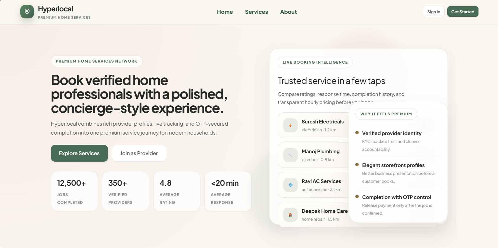 |  |  |

| Search Services             | Complaints                   | KYC Verification             |
|-----------------------------|------------------------------|------------------------------|
| 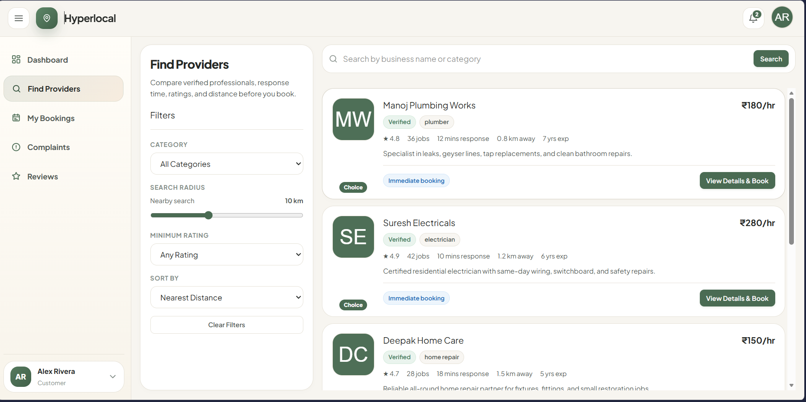 | 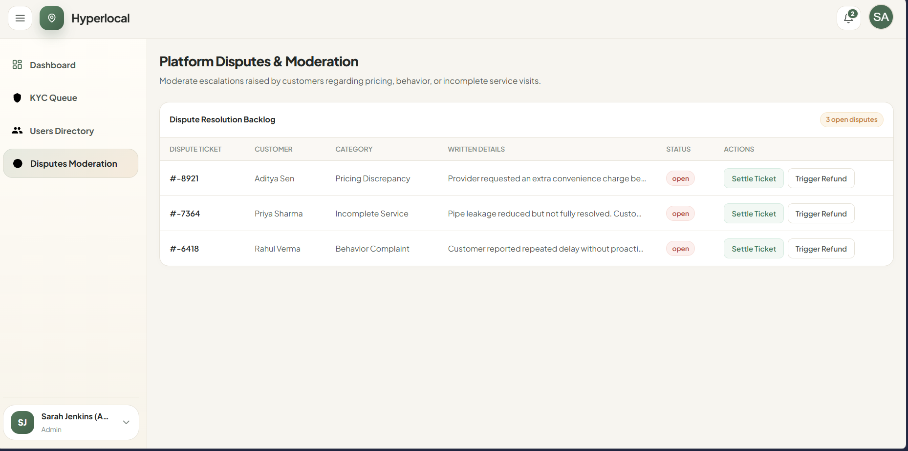 | 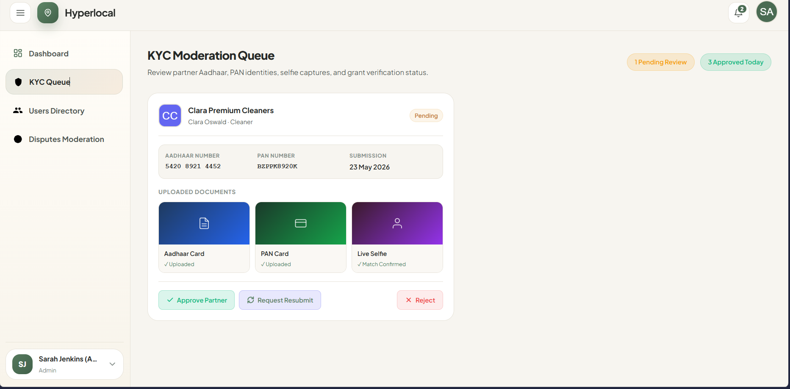 |

| Provider Profile            | User Details                 | Service Details              |
|-----------------------------|------------------------------|------------------------------|
| 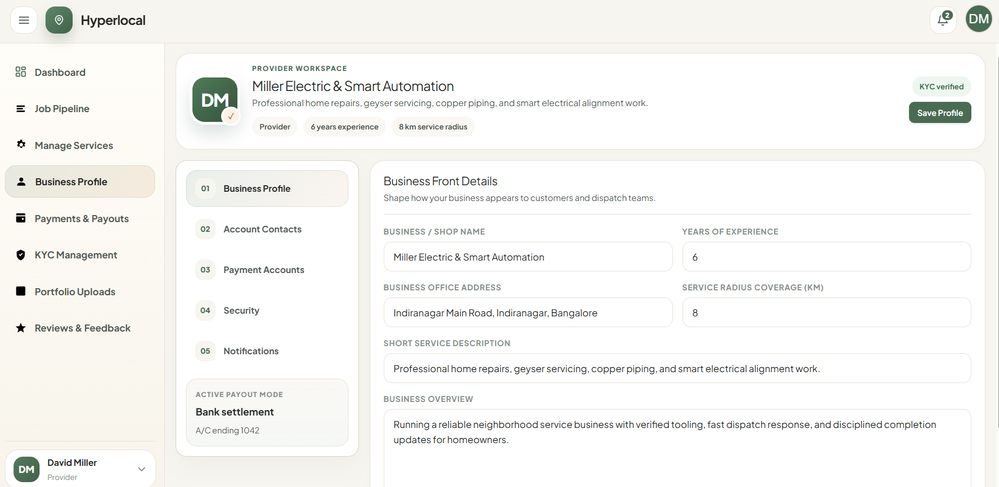 | 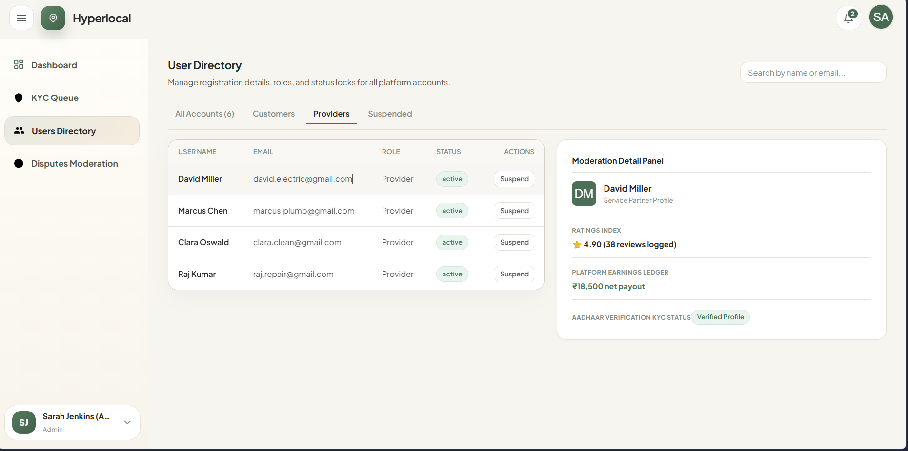 | 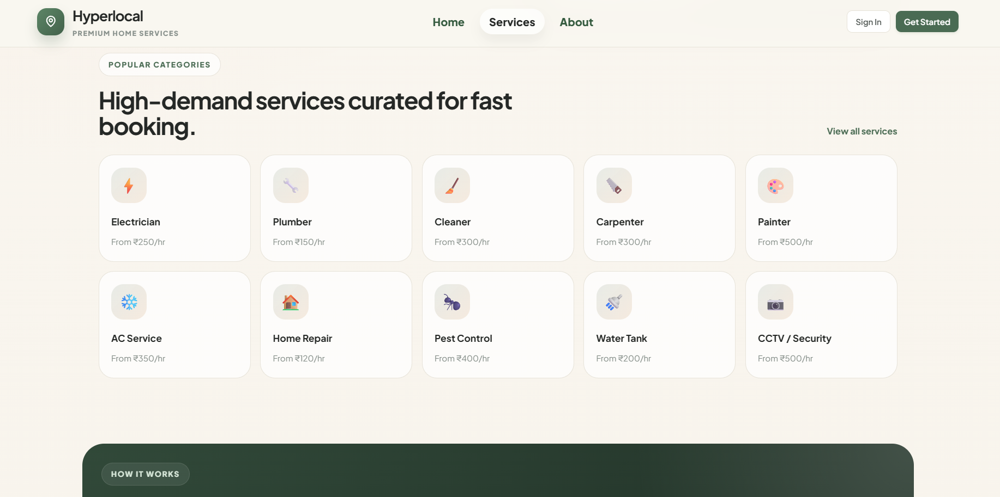 |


| Booking Status              | Track Provider               |
|-----------------------------|------------------------------|
|  | 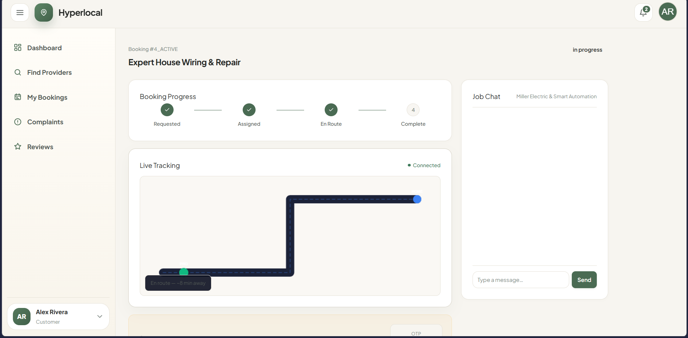 |

| Provider Details            | Review                       |
|-----------------------------|------------------------------|
| 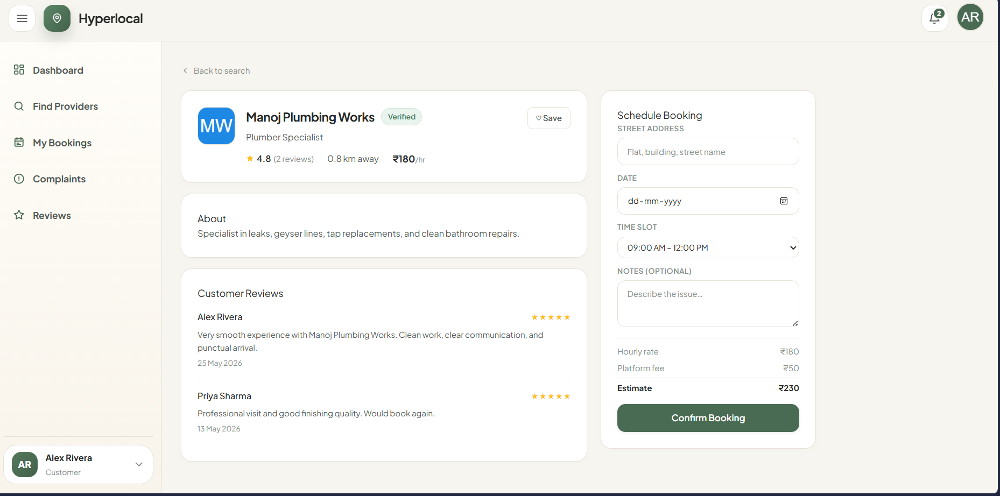 | 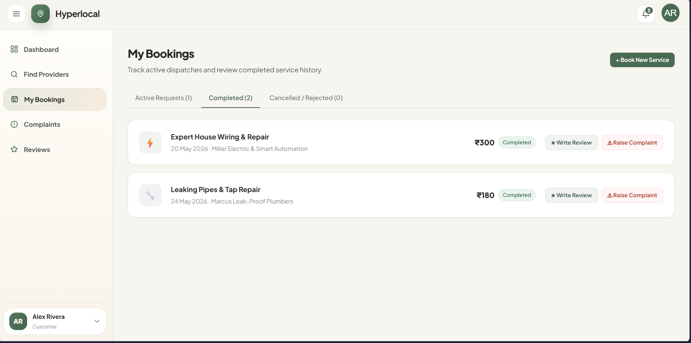 |

> _Replace the above placeholders with actual screenshots for best results._

---


## 🚀 Future Enhancements
- Mobile app (React Native/Flutter)
- Payment gateway integration
- Advanced analytics and reporting
- AI-powered service recommendations
- Multi-language support
- Push notifications

---


## 🤝 Contributing

Contributions are welcome! Please open an issue to discuss your ideas or submit a pull request. For major changes, start a discussion first to ensure alignment with project goals.

---


## 📄 License

This project is licensed under the MIT License. See the [LICENSE](LICENSE) file for details.

---


## 👨‍💻 Author


**Divya Prabha**  
[LinkedIn](https://www.linkedin.com/in/divya-prabha-323606399/)  
[GitHub](https://github.com/divyaprabha12)

---


---

> _This project demonstrates advanced full-stack engineering, scalable architecture, and modern development practices. Perfect for showcasing in your portfolio or resume._
